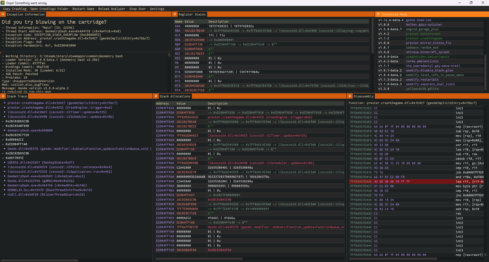

# BetterCrashlogs

> Note: This mod is still work in progress!

A mod that overhauls the crash log system in Geometry Dash.

## Features
- [x] Resizable window using ImGui
- [x] More information about the exception
- [x] Registers and stack memory display strings/pointers (if available)
- [x] Saves crash logs to a file
- [x] Ability to copy crash log to clipboard
- [x] Restart button to restart the game
- [x] Stack trace with better formatting
- [x] Stack memory view
- [x] Handling breakpoints
- [x] Ability to continue execution (may crash again)
- [x] Motivational quotes (like in Minecraft)
- [ ] Base game method names (no more GeometryDash.exe+0x123456)
- [ ] Fetch .pdb files from mod's GitHub repository (if available)
- [ ] Basic disassembly view (using Zydis)

## TODO
- [ ] Parse C++ exceptions
- [ ] Automatically get the latest broma file for the game
- [ ] Add a settings menu to configure the theme/font size
- [ ] Wait for geode v2.0.0-beta.24 to be released (some API changes are needed)